# Information Distance theory in a nutshell

*{Joel Gardes - Christophe Maldivi} Orange/IMT*

This part is explaining the fundamental principles developed in our algorithm for measuring similarities between two informations. The start-point lies on the side of thermodynamic information theory. Evaluating similarities between two informations can be done by measuring the thermodynamic cost of computing the transition between two finite strings of bytes.

The problem was to find what kind of computing, that means, what kind of program.

## About distances

### The general problem of distances

Before classifying or clustering a pattern we try to apply a measurement after having extracted characteristic features of this pattern. The problem is that we have a narrow dependency between pattern and features, features and distance definition and consequently, non generalizable methods of classification or clustering. And if this pattern is, for example, included in a picture, we encounter a problem of segmentation which affect feature extraction.

### Our hypothesis

To avoid this problem of dependencies we have explored methods used in genomic were similarities measure consist of considering a content (here, a DNA or RNA sequence extracted from a living cell) and applying methods to find ranges of similar pattern (subsequences). The base of this work is on "information distance" related, with a complete generic approach, detailed in [this document](http://homepages.cwi.nl/~paulv/papers/informationdistance.pdf) written by Charles H. Bennett, Péter Gács, Ming Li, Paul M. B. Vitányi, and Wojciech H. Zurek approach that we will summerize here in this part.

### Using compressors for measuring information distances 

A very undestandable explanation of this approach can be found [here](http://homepages.cwi.nl/~paulv/papers/SimilarityV3.pdf), in a paper written by Jean-Paul Delahaye and illustrated here :

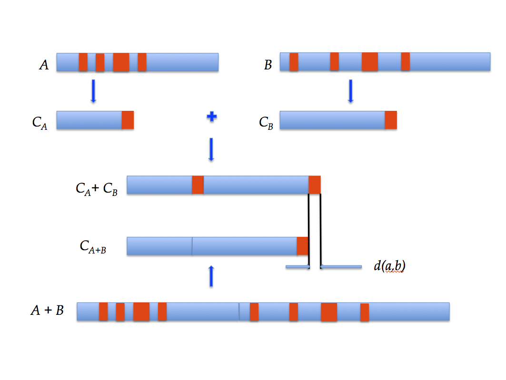

Given two strings of bytes, A and B, we aim to evaluate similarities between them. One side, we take the length of the two strings compressed separatly, other side we concatenate the two strings, apply a compression and take the obtained length. In the first step, common ranges of bytes are compressed twice (shown in red), In the second step, common ranges of bytes are merged. So one can observe that the difference of the two length is corresponding of similarities between the two strings.

As we will explain, the most important condition of this approach is to use ***reversible computing processes***, that means, lossless algorithms for data compression, but not compressors "as it" as we will explain. 

Understanding the reason of valuability of this approach needs to assume that information is physical (Bennett) and running a program (or a running universal Turing machine) involves an energy cost like thermodynamic systems (Landauer principle). That explains why we are considering that measuring similarity between two bytes strings is measuring the energy cost to have a complete transition from the start string to the goal string and vice-versa if we plan to consider this cost as an information distance.  

### Resemblance and difference with edit distance

One can observe that computing the transition between two finite strings of bytes is a very old method to measure distances. That is the classical edit distance. But, the problem of this simple and light algorithm is that we can find many solutions of transitions and, which is critical, non symmetric transitions. That can be written like this : 

Given X and Y, the two strings we want to measure and C, the computing process (or program) :

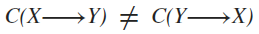

That means the shortest transition to start from Y to obtain X is not ever the symmetric of the shortest transition to start from X to obtain Y. This point is important, because we have noticed a similar problem when using standard lossless compressors as specified by the authors.

## About information distance

### General properties of all distances

Undependently of the method to compute it, a distance must have fundamental mathematical properties. Let d, a distance, and x, y, z, three measured objects (in our case, three informations):

### A generic, non-paramétric distance

Works of Charles H. Bennett,  Péter Gács, Ming Li, Paul M. B. Vitányi, and Wojciech H. Zurek, and first impementation of Rudi Cilibrasi, show an interesting approach of distance measurement from data compression. In order to understand the basics of this approach, we summerize here a Li's lecture on information distance.

The "bootstrap" of this demonstration is [Landauer's principle](http://www3.imperial.ac.uk/pls/portallive/docs/1/55905.PDF) who link information entropy to thermodynamic entropy, assuming by the way that information is physic. That assumption were demonstrated in detail in Bennett's thesis. Two fundamental equation were putted :

* The energy cost of computing, with the shortest program possible "p", a transformation of a byte sequence "x" to a bytes sequence "y" in an universal Turing machine "U"

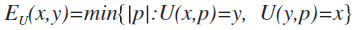

* The energy cost of computing join information between bytes sequences "x" knowing "y", and "y" knowing "x". C is join Kolmogorov complexity.

![cost_x2y] (../images/cost_x2y.png)

Note that these two equations are only available in a [reversible computing](https://en.wikipedia.org/wiki/Reversible_computing) context. 

The relationship between energy cost and distance can be shown by explaining the universality of these equation : 

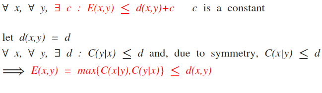 

Which, after normalization (for obtaining the capacity to measure a distance between short and long bytes sequences) conducts us to

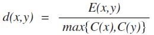 

And, finally, allows us to obtain the following expression of the information distance 

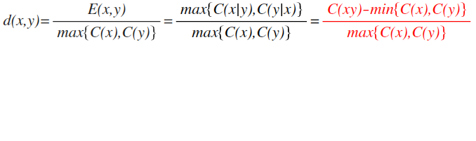

### Discussion about information distance equation

This equation is using Kolmogorov complexity. That means, although results having all properties of a distance,  it cannot be used "as it" in a program, because Kolmogorov complexity is a undecidable problem in computing, due to [Rice's theorem] (http://www.eecs.berkeley.edu/~luca/cs172/noterice.pdf) explaining schematically that a computer running a software whose function is computing the length of the shortest program describing a byte string, representing Kolmogorov's complexity, will not be able to detect if the formed program is the shortest one and will never stop.

To avoid this theoretical problem, Paul Vitányi and al. have demonstrated that using the length of bytes strings produced by lossless compressors will be a valuable approximation of Kolmogorov's complexity, which consists in replacing complexity terms by the length of compressed bytes strings in computing the distance of information between these two bytes strings. And they called these distance "Normalized Compression Distance" (NCD). One can summerize this approximation by considering that the length of a compressed file is, modulo a constant, proportionnal to the energy cost of input file compression.

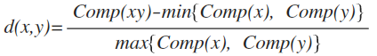

### Assymmetric distance matrix with standard lossless compressors

We found a remaining problem with distance properties, with any used standard compressors. For example, if one builds a distance of information matrix on DNA sequences using this equation with a bzip2 compressor, we obtain following result :

 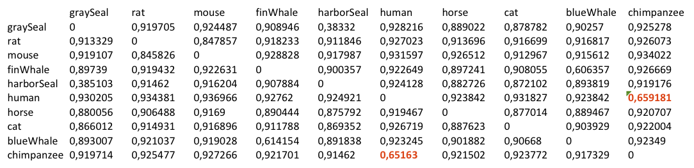
 
One can notice that symmetry properties is not respected. Although, if one reads [Delahaye's article](http://homepages.cwi.nl/~paulv/papers/SimilarityV3.pdf), showing relevant results on standard NCD, this problem of non symmetry is not penalizing with presented dataset which are limited on number and containing one sample by class. 

But clustering a large dataset with standard NCD, where each class is potentially containing a high number of sample and the dataset contains a potentially high number of classes, this assymmetry induces confusion in clusters content. Especially for character clustering, extracted from digitized documents.

The cause of this problem is **in inequality for Comp(xy) and Comp(yx) (compression) which violates the natural symmetry of C(xy) and C(yx) (Kolmogorov complexity)**. This inequality is shown here :

Let two files containing DNA description of a cat and a dog. We build two concatenation of these files, respectively :

	$cat cat dog > catdog
	$cat dog cat > dogcat
	
And we apply a standard lossless compression on obtained files 

	-rw-r--r--  1 somebody  staff  17009 12 mar  2015 cat
	-rw-r--r--  1 somebody  staff  33736  8 fév 10:05 catdog
	-rw-r--r--  1 somebody  staff   9899  8 fév 10:05 catdog.zip
	-rw-r--r--  1 somebody  staff  16727 12 mar  2015 dog
	-rw-r--r--  1 somebody  staff  33736  8 fév 10:05 dogcat
	-rw-r--r--  1 somebody  staff   9928  8 fév 10:05 dogcat.zip
 
Note the length difference of zipped files. The reason of this difference is on the side of assembled algorithms for building a compressor. Especially, [Huffman coding](https://en.wikipedia.org/wiki/Huffman_coding), used in bzip2, that produce context dependent families of graphs solutions of sequences parts. In our case, the part of "cat Huffman coding" or the part of "dog Huffman coding" are different in files catdog.zip and in dogcat.zip. **That implies to build a specific "compressor" using algorithms that will produce only one solution**, regardless the compression performance given by Huffman coding, used in bzip families.

### The "compressor" used in our NCD implementation

To proof the solution of assymetry problem, we have decided to build a very simplified "compressor" using an association of the [Burrows Wheeler transform](https://en.wikipedia.org/wiki/Burrows–Wheeler_transform) (block sorting) and a very classic [run-length encoding](https://en.wikipedia.org/wiki/Run-length_encoding). On DNA sequences, we obtain the following distance matrix :

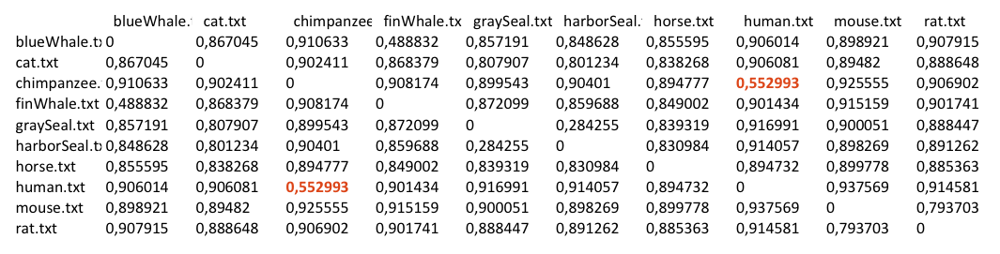

Note that symmetry was retrieved, separability maintained, like triangle inequality (which will be proofed by our implemented clustering algorithm based on triangulation).

## About data

### DNA

Shown examples used for explanation are DNA sequences. Regardless their biological role, DNA sequences contain information related with vegetal or animal species and are coded as random variable using four basic elements (the "letters" of the genetic alphabet): "A", "C", "G", "T". A sequence can be represented like this :

	gtttatgtagcttaactacccaaagcaaaacactgaaaatgtcgagacggctcacccgccccataaacaaataggtttggtcctagcctttctattagcccctggcaagattacacatgcaagcatccccgccccggtgaaatcgcccttcaaatcacccgtgatcaaaaggagcaggtatcaagcacgcagtaatgcagctcaaaacaccctgcctagccacacccccacgggagacagcagtgataaacctttagcaataaacgaaagtttaactaagctatgccaacccagggttggtcaacttcgtgccagccaccgcggtcatac

One can notice easily that each digit of this DNA code representation is a one byte code and that it is quite hard to find pattern inside such a sequence, because there is no easy detectable periodicity, neither stable separators, like a common computer file (no spaces, pipes ou quotes..., just the 4 digits). Nevertheless, NCD can measure similarities between different DNA sequences.

### Other examples

#### OCR

If we inspect digital content like picture, sound or text, we can also consider them as a sequence of bytes. Here is an example of a viewed character picture and its code in the old XPM format:

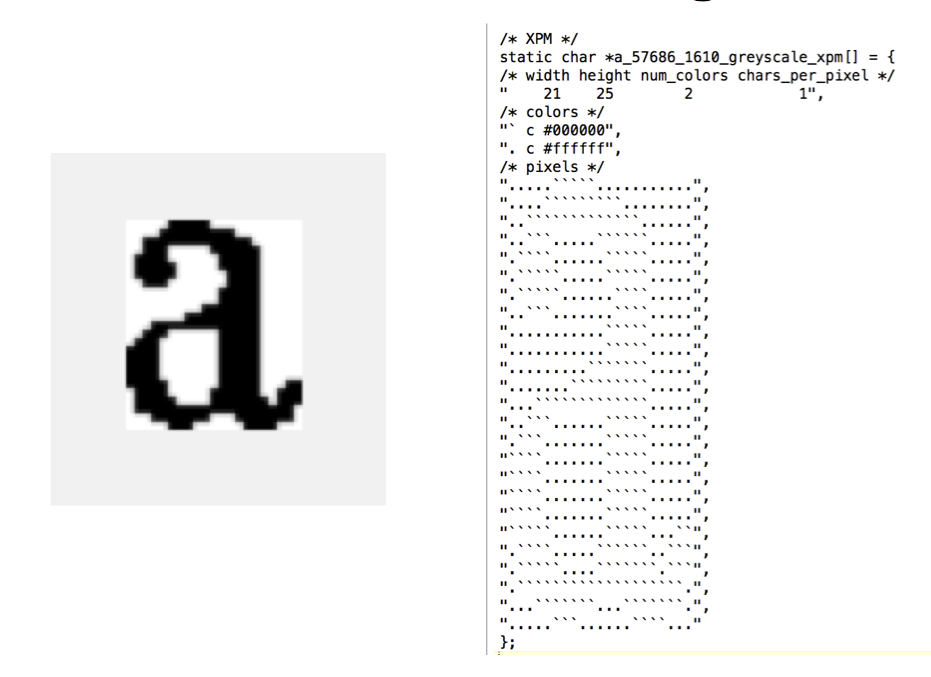

An OCR software is based to classify this kind of pattern compared to well indexed with character value reference images.

Following shows a similarity measurement between a character picture and 9200 characters extracted from two documents (named shortly "JO" and "ode") with two different fonts. Following picture shows a very short extract of this base

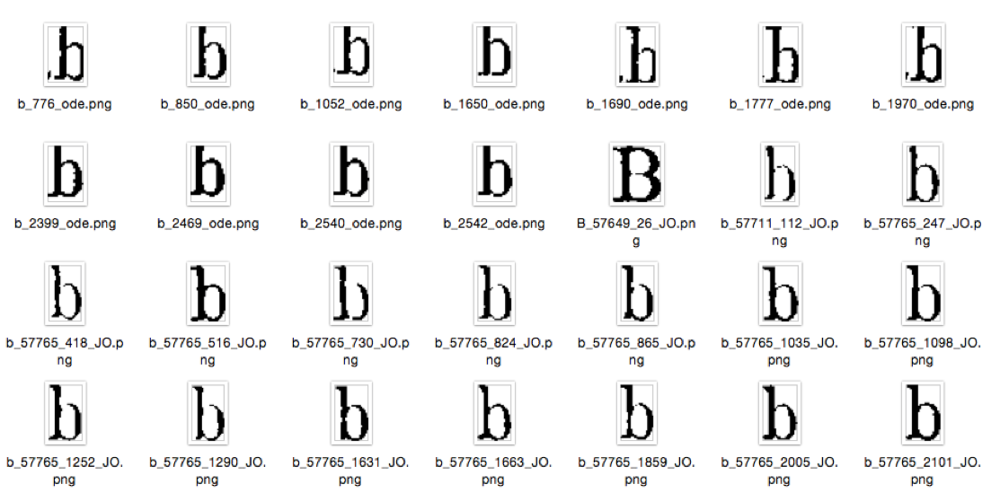

Results are sorted by increasing distance (first outputs : nearest_neighbours). reference files are coded with the value of character and the document name which was used to build reference. The candidate pattern was randomly extracted from this picture directory and measured. 

We have obtained this result

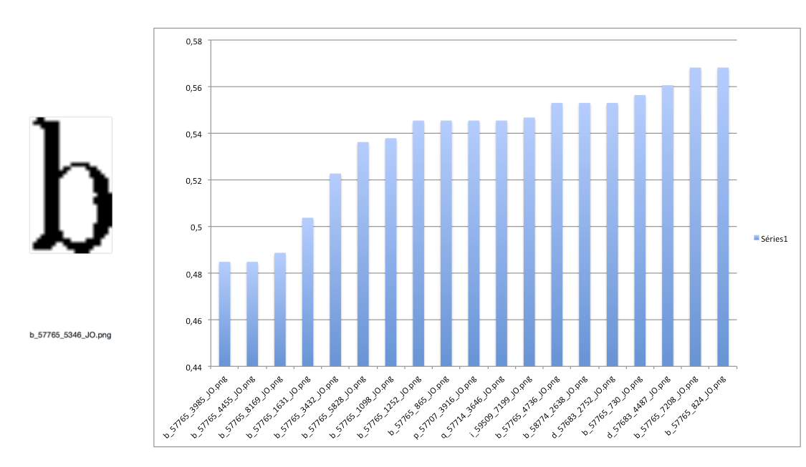

One can see that result are sorted by document and by character value. This font discrimination must be notified.

#### Text queries

A very common XML exchange format document for digital library (the "[ALTO](https://en.wikipedia.org/wiki/ALTO_(XML))" format) has this kind of structure (this part is extracted from a file we have named "X0000006.xml".
 
	
	</TextLine>
	<TextLine ID="PAG_00000006_TL000009" STYLEREFS="TXT_2" HEIGHT="35" WIDTH="725" HPOS="115" VPOS="703">
	<String ID="PAG_00000006_ST000061" STYLEREFS="TXT_2" HEIGHT="30" WIDTH="95" HPOS="115" VPOS="706" CONTENT="Quand" WC="1" WD="true"/>
	<SP ID="PAG_00000006_SP000053" WIDTH="17" HPOS="208" VPOS="708"/>
	<String ID="PAG_00000006_ST000062" STYLEREFS="TXT_2" HEIGHT="21" WIDTH="28" HPOS="223" VPOS="710" CONTENT="tu" WC="1" WD="true"/>
	<SP ID="PAG_00000006_SP000054" WIDTH="16" HPOS="249" VPOS="714"/>
	<String ID="PAG_00000006_ST000063" STYLEREFS="TXT_2" HEIGHT="26" WIDTH="119" HPOS="263" VPOS="706" CONTENT="marches" WC="1" WD="true"/>
	<SP ID="PAG_00000006_SP000055" WIDTH="13" HPOS="380" VPOS="713"/>
	<String ID="PAG_00000006_ST000064" STYLEREFS="TXT_2" HEIGHT="18" WIDTH="34" HPOS="391" VPOS="713" CONTENT="au" WC="1" WD="true"/>
	<SP ID="PAG_00000006_SP000056" WIDTH="14" HPOS="423" VPOS="705"/>
	<String ID="PAG_00000006_ST000065" STYLEREFS="TXT_2" HEIGHT="26" WIDTH="64" HPOS="435" VPOS="705" CONTENT="bras" WC="1" WD="true"/>
	<SP ID="PAG_00000006_SP000057" WIDTH="16" HPOS="497" VPOS="705"/>
	<String ID="PAG_00000006_ST000066" STYLEREFS="TXT_2" HEIGHT="26" WIDTH="34" HPOS="511" VPOS="705" CONTENT="de" WC="1" WD="true"/>
	<SP ID="PAG_00000006_SP000058" WIDTH="16" HPOS="543" VPOS="708"/>
	<String ID="PAG_00000006_ST000067" STYLEREFS="TXT_2" HEIGHT="21" WIDTH="46" HPOS="557" VPOS="708" CONTENT="ton" WC="1" WD="true"/>
	<SP ID="PAG_00000006_SP000059" WIDTH="16" HPOS="601" VPOS="707"/>
	<String ID="PAG_00000006_ST000068" STYLEREFS="TXT_2" HEIGHT="31" WIDTH="94" HPOS="615" VPOS="707" CONTENT="époux," WC="0.99" WD="true"/>
	<SP ID="PAG_00000006_SP000060" WIDTH="19" HPOS="707" VPOS="703"/>
	<String ID="PAG_00000006_ST000069" STYLEREFS="TXT_2" HEIGHT="25" WIDTH="116" HPOS="724" VPOS="703" CONTENT="heureux" WC="1" WD="true"/>
	</TextLine>
	
	
Knowlegde on markup definition allows to build a document presentation and indexation. But, without this knowledge, trying to build queries for detecting what document is containing a complete text string will be difficult.

The exercise consists here by comparing a string "au bras de ton époux heureux" coded as it in a file named "4.txt" with a set of XML files containing "X0000006.xml". Here is the sorted list of increasing distances :

 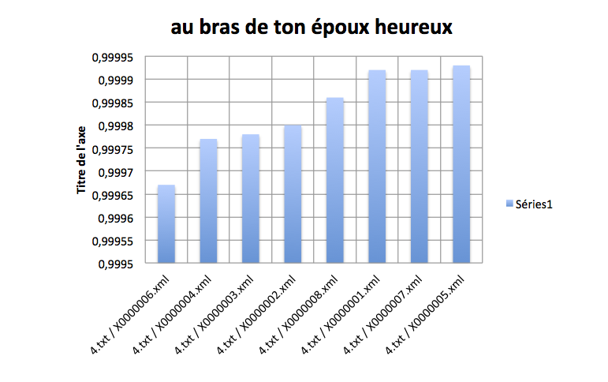
 
The ability of NCD to make abstraction of all file markups must be notified. The weak value of distance intervals is due to normalization : 4.txt has a 28 bytes length, Alto files near 1 Mb.

## Conclusion on this information distance measurement method

Main relevant property of this distance which is an evolution of normalized distance of compression ("standard NCD") lies in its ***non-parametric nature***. Compared with standard NCD, we have corrected the default of symmetry due by using standard compressors, previous authors having priviledged compression performance rather stability of computing. This evolution allows to use this distance with large dataset.

The described information distance measurement can be easily used with many kinds of content coded in a continuous discrete format like text, sound or picture. The condition is the unicity of file format, if not, results will include a "by file format" sorting. For graphical elements (geometric coded), that have not this continuity, this measurement is not available "as it", we recommand to rasterise such content.

 
 
