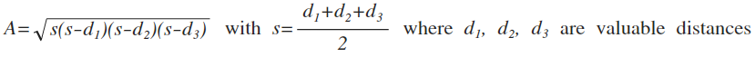
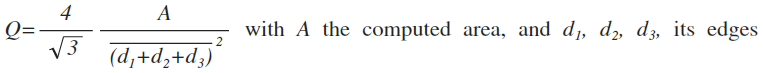
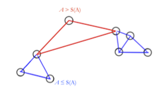
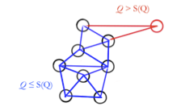
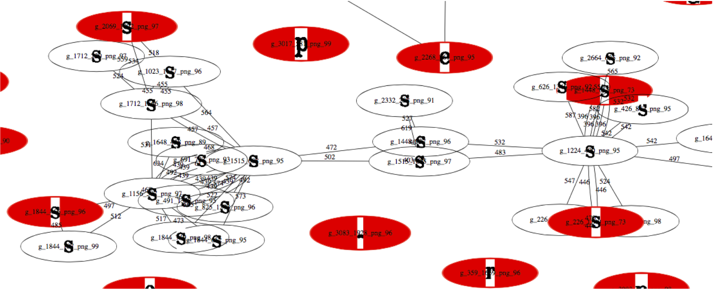

# Clustering by triangulation with graphs

*{Joël Gardes - Christophe Maldivi} Orange/IMT*

## Introduction

This part is describing a data clustering method from a matrix distance. Specificity of the method :

* unsupervised
* heuristic free
* producing reject 

The distance matrix used here, is produced with our information distance measurement method, but all convenient square distance matrix is available.

## Main steps of clustering

### Triangulation in distance matrix

The process takes a current element and search his first neighbor as following element. Then, the first neighbor of following element is catched. These three element are forming a triangle whose edge are known. first and second edges are distances corresponding with first nearests neighbours of two first summits, third edge is corresponding with distance between first and third summit (also named vertex).

For building groups of patterns, two properties of triangle are computed :

* areas
* equilaterality

Each area is computed using Heron's formula :

This formula works only if distances are forming a triangle, **that validates the triangular inequality property of information distance**.

Equilaterality of each triangle is computed with the same formula used in cristallography to estimate this property :

#### Usage of computed properties of triangles

The Areas of triangles are used to evaluate local high density of patterns distribution. 

The equilaterality factors are used to evaluate local isotropies of patterns distribution : in homogeneous clusters, patterns are near equistant.

#### Thresholding in areas and equilaterality factors

The threshold values are computed on means and standard deviation on all areas and all equilaterality factors. Classicaly, a value of two standard deviation is put by default and can be adjusted.

This approach can determinate a fisrt level of groups segmentation from a global statistic distribution of patterns. Out of threshold pattern having no remaining connexion with other patterns are defined as "singletons" patterns, corresponding to a reject from clustering process.  

Sub-graphs are produced where information distances are the edges and patterns are the nodes. A part of such segmented sub-subgraphs in a characters clustering application, is shown as following after a GraphViz conversion.

  

 

